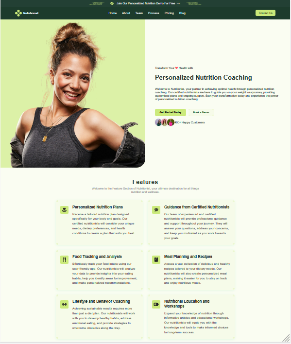
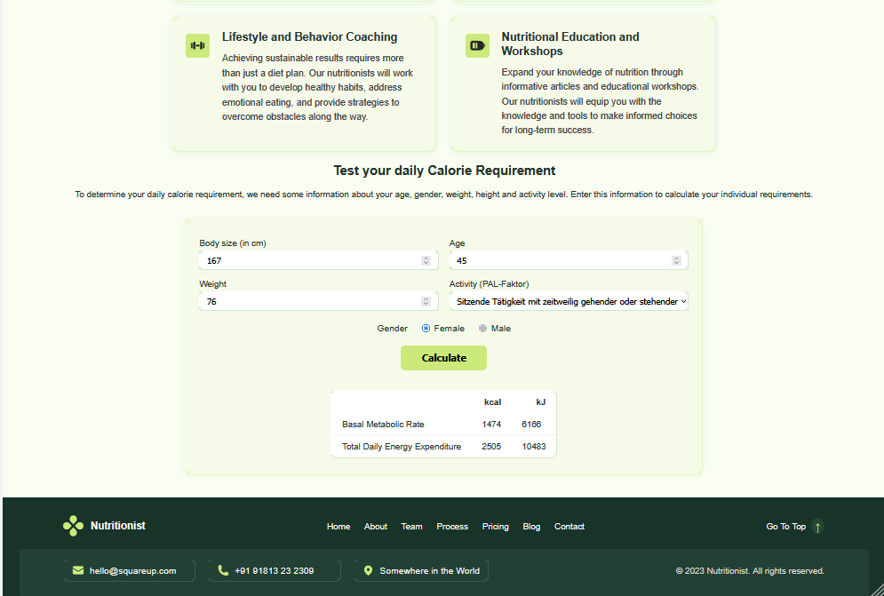

# SuperCode Projekt: HealthApp

## Beschreibung

**HealthApp** ist eine einseitige Webanwendung (Landing Page) für personalisiertes Ernährungscoaching und einen gesunden Lebensstil.  
Auf der Startseite werden die Hauptvorteile der Plattform und ein Kalorienrechner präsentiert.

---

## Hauptfunktionen

- **Modernes, responsives Design**
- **Navigation** und Promo-Bar mit Icons und Styling nach Figma-Design
- **Abschnitt "Features"** — die wichtigsten Vorteile des Angebots
- **Kalorienrechner**  
  - Berechnet den täglichen Kalorienbedarf basierend auf den Angaben der Nutzer:innen (Größe, Gewicht, Alter, Geschlecht, Aktivitätsniveau)
- **Responsives Layout** (Desktop, Tablet, Mobile)
- **Moderne CSS-Techniken**  
  (Grid, Flexbox, Farbvariablen, Buttons und mehr)

---

## Projekt starten

1. **Repository klonen:**
git clone https://github.com/NatalyBova111/SuperCode_Project_HealthApp.git
2. Projektordner im Editor (z.B. VS Code) öffnen.
3. Datei index.html im Browser öffnen.

## Technologien

    HTML5, CSS3 (responsive Webentwicklung, individuelle Komponenten)

    JavaScript (Kalorienrechner)

    Figma (Design)

## Autorin: 
NatalyBova111